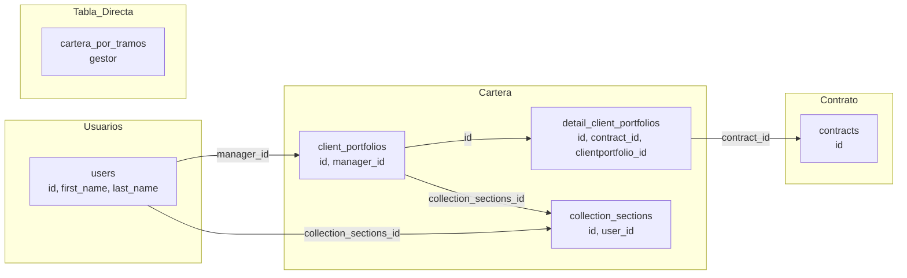

# Gestor de Cobranzas — Esquema de Datos EPEM

> **Fuente:** MySQL `epem` (motor 8.0.27) — extraído de `docs/agents/mysql-epem-schema-agent-guide.md`
> **Fecha de generación:** 2026-06-02

---

## 1. Resumen Ejecutivo

El **gestor de cobranzas** en EPEM está modelado a través de la tabla `client_portfolios` (cartera del cliente), que vincula un contrato con un **manager (gestor)** vía `manager_id` → `users.id`.

Además, existe una tabla auxiliar `detail_client_portfolios` que detalla la cartera por contrato individual, y una tabla `collection_sections` que agrupa los gestores por secciones de cobranza.

Por último, la tabla nativa **`cartera_por_tramos`** ya contiene una columna directa `gestor` (varchar) con el nombre del gestor.

---

## 2. Entidades Principales

### 2.1 `users` — Tabla Central de Usuarios/Gestores

| Campo | Tipo | Descripción |
|-------|------|-------------|
| `id` | `int unsigned` | PK. Referenciado 428 veces por otras tablas |
| `first_name` | `varchar(191)` | Nombre del gestor |
| `last_name` | `varchar(191)` | Apellido del gestor |
| `email` | `varchar(191)` | Correo |
| `collection_sections_id` | `int unsigned` | FK → `collection_sections.id` (sección de cobranza) |

**Rol:** Es la tabla pivote. Todo gestor de cobranzas es un usuario del sistema con asignación en `collection_sections`.

---

### 2.2 `client_portfolios` — Cartera del Cliente (asignación de gestor)

| Campo | Tipo | Descripción |
|-------|------|-------------|
| `id` | `int unsigned` | PK |
| `manager_id` | `int unsigned` | **FK → `users.id`** — **Este es el gestor de cobranzas asignado** |
| `from_date` | `date` | Fecha desde que gestiona la cartera |
| `until_date` | `date` | Fecha hasta (si fue reasignado) |
| `collection_sections_id` | `int unsigned` | FK → `collection_sections.id` |
| `user_id` | `int unsigned` | Usuario que creó el registro |
| `status` | `tinyint(1)` | Activo/Inactivo |

**Rol:** Define **quién es el gestor responsable** de una cartera de clientes. `manager_id` apunta a `users.id`.

---

### 3.3 `detail_client_portfolios` — Detalle por Contrato

| Campo | Tipo | Descripción |
|-------|------|-------------|
| `id` | `int unsigned` | PK |
| `clientportfolio_id` | `int unsigned` | FK → `client_portfolios.id` |
| `contract_id` | `int unsigned` | FK → `contracts.id` |
| `collection_sections_id` | `int unsigned` | FK → `collection_sections.id` |
| `expired_quotas` | `int` | Cuotas vencidas |
| `expired_amount` | `decimal(11,2)` | Monto vencido |
| `quota_amount` | `decimal(11,2)` | Monto cuota |
| `total_collection` | `decimal(11,2)` | Total a cobrar |
| `last_tracking_id` | `int unsigned` | FK → `recovery_trackings.id` |
| `next_expiration_to_pay` | `date` | Próxima expiración |

**Rol:** Desagrega la cartera a nivel de **contrato individual**. Para saber el gestor de un contrato, se hace:
```sql
SELECT cp.manager_id 
FROM detail_client_portfolios dcp
JOIN client_portfolios cp ON cp.id = dcp.clientportfolio_id
WHERE dcp.contract_id = ?
```

---

### 2.4 `collection_sections` — Secciones de Cobranza

| Campo | Tipo | Descripción |
|-------|------|-------------|
| `id` | `int unsigned` | PK |
| `client_portfolios_id` | `int unsigned` | FK → `client_portfolios.id` |
| `enterprise_id` | `int unsigned` | FK → `enterprises.id` |
| `user_id` | `int unsigned` | FK → `users.id` |

**Rol:** Agrupa los gestores por secciones/áreas de cobranza. Un gestor (`users`) pertenece a una sección (`collection_sections_id`).

---

### 2.5 `cartera_por_tramos` — Cartera con Gestor Directo

| Campo | Tipo | Descripción |
|-------|------|-------------|
| `gestor` | `varchar(191)` | **Nombre directo del gestor** (ya calculado) |
| *(otros campos de cartera)* | ... | Tramo, cuotas, montos, etc. |

**Rol:** Tabla nativa del sistema EPEM que **ya tiene el nombre del gestor** como columna directa. Es la fuente más simple si se puede acceder a ella.

---

## 3. Diagrama de Relaciones



**Flujo de resolución:**
```
contrato (contracts.id)
  → detail_client_portfolios.contract_id
    → detail_client_portfolios.clientportfolio_id
      → client_portfolios.id
        → client_portfolios.manager_id
          → users.id (gestor)
```

O directamente desde `cartera_por_tramos.gestor` si se usa esa tabla.

---

## 4. Mapeo al BI (PostgreSQL)

En el pipeline del BI EPEM, el gestor se trae de MySQL a PostgreSQL de la siguiente manera:

### 4.1 Query SQL v2 (`sql/v2/query_cartera.sql`)

```sql
-- JOIN con users para obtener el gestor via last_collection_manager_id
LEFT JOIN users gestor_user
    ON gestor_user.id = ccd.last_collection_manager_id

-- En el SELECT:
CONCAT_WS(' ', gestor_user.first_name, gestor_user.last_name) AS Gestor
```

**Nota:** `ccd.last_collection_manager_id` parece ser un campo en `contracts` o `contract_collection_details` que guarda el último gestor asignado.

### 4.2 Modelo Postgres (`backend/app/models/brokers.py`)

```python
class CarteraFact(Base):
    # ... campos existentes ...
    gestor = Column(String(128), nullable=False, default="S/D", index=True)
```

### 4.3 Tablas Agg con gestor

- `CobranzasCohorteAgg` — agregado por cutoff_month, sale_month, un, supervisor, **gestor**
- `MvOptionsCohorte` — opciones de filtro incluyen **gestor**

---

## 5. Queries de Ejemplo

### 5.1 Obtener gestor de un contrato

```sql
SELECT 
    c.id AS contract_id,
    CONCAT_WS(' ', u.first_name, u.last_name) AS gestor
FROM contracts c
LEFT JOIN detail_client_portfolios dcp 
    ON dcp.contract_id = c.id
LEFT JOIN client_portfolios cp 
    ON cp.id = dcp.clientportfolio_id
LEFT JOIN users u 
    ON u.id = cp.manager_id
WHERE c.id = 12345;
```

### 5.2 Cartera por gestor (vía cartera_por_tramos)

```sql
SELECT 
    gestor,
    COUNT(*) AS contratos,
    SUM(expired_amount) AS total_vencido
FROM cartera_por_tramos
WHERE status = 1
GROUP BY gestor;
```

### 5.3 Contratos sin gestor asignado

```sql
SELECT c.id
FROM contracts c
LEFT JOIN detail_client_portfolios dcp 
    ON dcp.contract_id = c.id
WHERE dcp.id IS NULL 
   OR dcp.clientportfolio_id IS NULL;
```

---

## 6. Glosario

| Término | Significado |
|---------|-------------|
| **Gestor** | Usuario (`users`) asignado como `manager_id` en `client_portfolios`. Responsable de cobrar la cartera. |
| **Cartera** | Conjunto de contratos asignados a un gestor para cobranza. |
| **Sección** | Agrupación lógica de gestores (`collection_sections`). Ej: "Cobranza Medicina", "Cobranza Odontología". |
| **Portfolio** | En EPEM, `client_portfolios` = cartera de un cliente (o grupo de clientes) asignada a un gestor. |
| **detail_client_portfolios** | Nivel de granularidad contrato. Un cliente puede tener múltiples contratos, cada uno en la cartera. |

---

## 7. Estado en el BI

| Componente | Estado |
|------------|--------|
| Query SQL v2 (`query_cartera.sql`) | ✅ JOIN con `users` via `last_collection_manager_id` |
| Migración Postgres (`0029_cohorte_gestor`) | ✅ Aplicada. `gestor` en `cartera_fact`, `cobranzas_cohorte_agg`, `mv_options_cohorte` |
| Normalización en sync | ✅ `sync_normalizers.py` normaliza `gestor` |
| Refresh agregado | ✅ `sync_refresh.py` hace GROUP BY `gestor` |
| Filtro en API | ✅ `CobranzasCohorteIn` acepta `gestor: list[str]` |
| Filtro en frontend | ✅ `AnalisisCobranzasCohorteView.tsx` renderiza filtro "Gestor" |
| Build Docker | ✅ Imagen frontend rebuilded y corriendo |

---

*Documento generado automáticamente a partir del esquema MySQL EPEM.*
